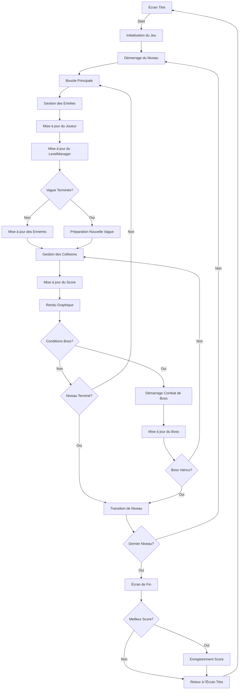

```mermaid
graph TD
    A[Écran Titre] -->|Start| B[Initialisation du Jeu]
    B --> C[Démarrage du Niveau]
    C --> D[Boucle Principale]
    D --> E[Gestion des Entrées]
    E --> F[Mise à jour du Joueur]
    F --> G[Mise à jour du LevelManager]
    G --> H{Vague Terminée?}
    H -->|Non| I[Mise à jour des Ennemis]
    H -->|Oui| J[Préparation Nouvelle Vague]
    I --> K[Gestion des Collisions]
    J --> K
    K --> L[Mise à jour du Score]
    L --> M[Rendu Graphique]
    M --> N{Conditions Boss?}
    N -->|Non| O{Niveau Terminé?}
    N -->|Oui| P[Démarrage Combat de Boss]
    O -->|Non| D
    O -->|Oui| Q[Transition de Niveau]
    P --> R[Mise à jour du Boss]
    R --> S{Boss Vaincu?}
    S -->|Non| K
    S -->|Oui| Q
    Q --> T{Dernier Niveau?}
    T -->|Non| C
    T -->|Oui| U[Écran de Fin]
    U --> V{Meilleur Score?}
    V -->|Oui| W[Enregistrement Score]
    V -->|Non| X[Retour à l'Écran Titre]
    W --> X
    X --> A
```
